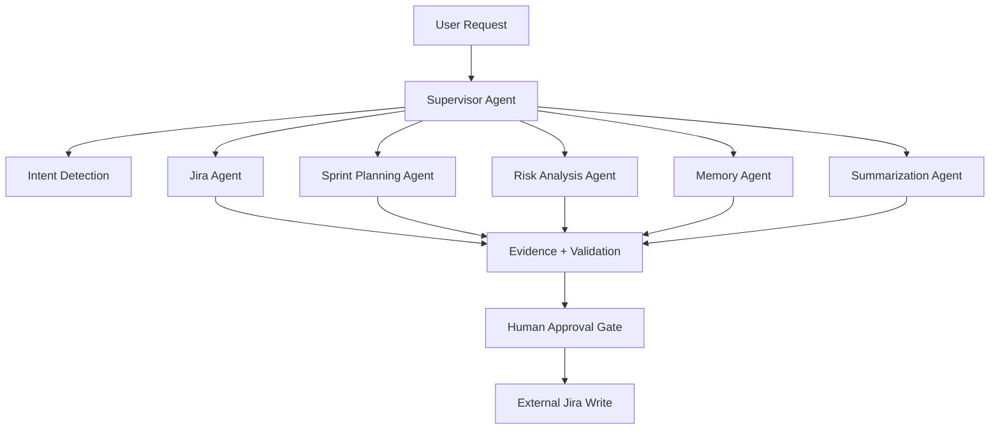

<div align="center">


<p>
  <b>Turn every conversation into an intelligent project workflow.</b>
</p>

<p>
  
  
  
  
  
</p>

</div>

---

## ✨ What is SprintMind AI?

**SprintMind AI** is a premium full-stack AI project-management platform for Jira-connected teams. It combines a polished SaaS frontend, FastAPI backend, multi-agent workflow execution, sprint analytics, memory, audit trails, and human approval gates before external Jira writes.

> Built as a portfolio-grade AI engineering product with real-world architecture, demo mode, security boundaries, and production-minded workflow design.

---

## 🚀 Core Highlights

- 🤖 **Multi-agent workflow system** with Supervisor, Jira, Sprint Planning, Risk, Memory, Summarization, and Workflow agents
- 💬 **AI chat workspace** for natural-language project operations
- ✅ **Human approval gate** before Jira write actions
- 📊 **Sprint analytics dashboard** with velocity, blockers, workload, and automation activity
- 🧠 **Persistent project memory** for rules, ownership, and decisions
- 🔐 **Security-first backend** with HttpOnly auth, encrypted Jira tokens, RBAC-ready structure, and audit logs
- 🧾 **Workflow timeline** for tools, approvals, evidence, retries, and final output
- 🧪 **Demo mode included** so the product works without real Jira credentials

---

## 🧭 Workflow Graph



---

## 🛠️ Tech Stack

| Layer | Technology |
|---|---|
| Frontend | Next.js 15, React 19, TypeScript, Tailwind CSS |
| UI/UX | Framer Motion, Lucide Icons, Recharts, responsive app shell |
| Backend | FastAPI, Python, Pydantic, SQLAlchemy Async |
| Database | PostgreSQL, SQLite demo mode, Alembic migrations |
| AI | OpenAI integration points, deterministic demo fallback |
| Jobs | Redis, Celery, scheduled reconciliation architecture |
| DevOps | Docker Compose, GitHub Actions, Makefile |
| Testing | Vitest, Testing Library, Pytest, Ruff, TypeScript checks |

---

## 📦 Monorepo Structure

```text
sprintmind-ai/
├─ apps/
│  ├─ web/              # Next.js SaaS frontend
│  └─ api/              # FastAPI backend
├─ packages/
│  ├─ shared-types/     # Shared TypeScript contracts
│  └─ design-tokens/    # Design system tokens
├─ docs/                # Architecture + security docs
├─ infrastructure/      # Database/init support
├─ docker-compose.yml
├─ Makefile
└─ README.md
```

---

## ⚡ Quick Start

```bash
git clone https://github.com/YOUR_USERNAME/sprintmind-ai.git
cd sprintmind-ai

cp .env.example .env
npm run install:all
docker compose up postgres redis
```

Run the API:

```bash
python -m uvicorn app.main:app --reload --app-dir apps/api
```

Run the web app:

```bash
npm run dev --workspace @sprintmind/web
```

Open:

```text
Web:      http://localhost:3000
API:      http://localhost:8000
API Docs: http://localhost:8000/docs
```

---

## 🪟 Windows PowerShell Note

If PowerShell blocks npm scripts, run commands like this:

```powershell
cmd /c npm run install:all
cmd /c npm run dev --workspace @sprintmind/web
```

---

## 🔑 Environment Setup

```env
DATABASE_URL=sqlite+aiosqlite:///./sprintmind.db

OPENAI_API_KEY=
OPENAI_MODEL=gpt-5-mini
OPENAI_EMBEDDING_MODEL=text-embedding-3-large

ATLASSIAN_CLIENT_ID=
ATLASSIAN_CLIENT_SECRET=
ATLASSIAN_REDIRECT_URI=http://localhost:8000/api/v1/jira/callback
ATLASSIAN_SCOPES=read:jira-work write:jira-work read:jira-user offline_access
```

---

## 🧪 Common Commands

```bash
make setup
make api
make web
make migrate
make test
make lint
make build
make docker-up
```

Or directly:

```bash
npm run test
npm run lint
npm run build
npm run typecheck
```

---

## 🔐 Security Model

- HttpOnly cookie-based auth
- Refresh token rotation tables
- Argon2 password hashing
- Encrypted Jira token storage
- Organization-scoped data access
- Server-side validation for AI tool calls
- Approval-first external writes
- Audit logs for workflow activity
- Uploaded documents treated as untrusted input

---

<div align="center">

### ⭐ If you like this project, give it a star!

<b>Plan. Track. Summarize. Automate.</b>

</div>
